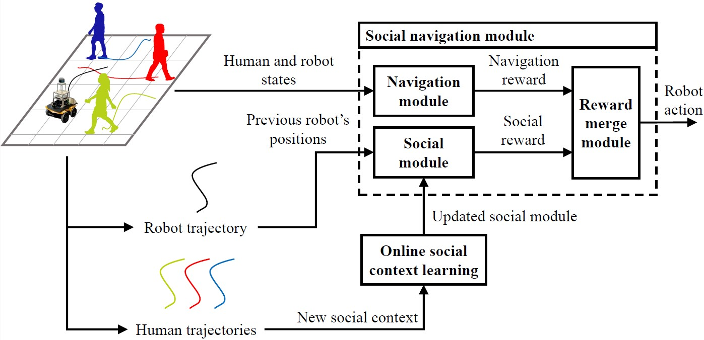

# SOCSARL-OL

**[`Paper`](http://arxiv.org/abs/2406.11495) | [`Data`]() | [`Video`](https://youtu.be/bwmoqu_fyUo)**

This repository contains the code and data for our paper titled **Online Context Learning for Socially-compliant Navigation**.

In the paper, we apply the CrowdNav simulator and the Thor-Magni dataset to train the social module.   
- [Crowd-Robot Interaction: Crowd-aware Robot Navigation with Attention-based Deep Reinforcement Learning, ICRA, 2019](https://github.com/vita-epfl/CrowdNav).
- [THOR-MAGNI: A Large-scale Indoor Motion Capture Recording of Human Movement and Robot Interaction, 2024](https://github.com/tmralmeida/magni-dash/tree/dash-public?tab=readme-ov-file).

## Abstract
Social robot navigation is a complex problem that requires the implementation of high-quality human-robot interactions to ensure that robot movements do not reduce human comfort or performance.
The objective of this research is to enhance the social efficiency and reliability of mobile robot navigation in a variety of context environments.
In order to achieve this, a new deep reinforcement learning method, SOCSARL-OL, has been proposed for robot navigation. The proposed method is designed to implement efficient human-robot interaction in different social contexts with the help of a social online learning module.
The efficacy of the proposed method was demonstrated in a variety of scenarios, with the most challenging scenario exhibiting an 8\% improvement in reaching the robot's goal without collision over the state-of-the-art methods.
The objective of this research is to enhance the social efficiency and reliability of mobile robot navigation in a variety of context environments.

## Method Overview


## Train the Social module on the Magni dataset
The **Magni** folder contains the trajectory dataset used for training, which is located in the **Clean_data** folder. These trajectories consist of the human trajectories from the Magni dataset and their copies created using the ORCA algorithm to have non-social trajectories.
The **Tracklet_4s_4hz_v** folder contains preprocessed tracklets from the Magni dataset.  

- Each tracklet consists of **16 points** (`step = 16`).
- The frequency of points in a tracklet is **4 Hz** (`hz = 4`).
- Each point includes the agent's velocity (`velocity = True`).
  
## Files and Their Functions

#### `tracklets_creator.py`
- Contains the **TrackletsCreator** class, which processes the dataset by reading data, building trajectories, and splitting them into tracklets.
- **Key functions:**

  - #### `load_csv_from_folder(folder=None)`
    - Loads CSV dataset files from a specified `folder`.  
    - If no folder is specified, it defaults to the folder set in the class constructor (**Clean_data**).

  - #### `create_tracklets(step, hz, save=True, folder, velocity)`
    - Generates tracklets from the trajectories and saves them as CSV files in the specified `folder` (if `save=True`).
    - **Parameters:**
      - `step` – Number of points in each tracklet.
      - `hz` – Frequency of points in a tracklet.
      - `velocity` – If `True`, tracklets will include the agent’s velocity.

#### `classification.py`
- Contains the **TrackletsClassificator** class, which classifies tracklets as **social** or **non-social**.
- **Key functions:**

  - #### `train_and_test(train_dataloader, criterion, optimizer, max_epochs)`
    - Trains the social module using CSV files with tracklets.

  - #### `train_and_test_k_fold(train_dataloader, criterion, optimizer, max_epochs)`
    - Trains the social module using CSV files with tracklets.
    - Evaluates loss-accuracy using **k-fold cross-validation**.

#### `plot.py`
- Contains the **Drawer** class, which draws the human trajectory and its robot non-social copy.
- **Key functions:**

  - #### `plot_pair_trajectoies(ped_traj, rob_traj, st, end, index, save)`
  - Plots the trajectories of a human (`ped_traj`) and a robot (`rob_traj`) within a specified time range and saves the visualization as a `.pdf` file.
  - **Parameters:**
    - `ped_traj` – List of human trajectories from the `.csv` file.
    - `rob_traj` – List of robot trajectories from the `.csv` file.
    - `st` – Start time for trajectory visualization.
    - `end` – End time for trajectory visualization.
    - `index` – Index of the human-robot trajectory pair to plot (`ped_traj[index]` and `rob_traj[index]`).
    - `save` – Boolean flag indicating whether to save the plot as a `.pdf` file.

## Running the Code
```
cd Magni
```
(Optional) To generate tracklets with different parameters (`step, hz, velocity`) from the saved trajectories, run the following commands:
```
python3 tracklets_creator.py
```
To train the social module, run the following commands:
```
python3 classification.py
```

## Setup of CrowdNav simulator
1. Install [Python-RVO2](https://github.com/sybrenstuvel/Python-RVO2) library
2. Install crowd_sim and crowd_nav into pip
```
pip3 install -e .
```
(optional) Uninstall crowd_sim and crowd_nav into pip
```
pip3 uninstall crowdnav
```

## Getting Started in CrowdNav simulator
This repository is organized in two parts: gym_crowd/ folder contains the simulation environment and
crowd_nav/ folder contains codes for training and testing the policies. Details of the simulation framework can be found
[here](crowd_sim/README.md). Below are the instructions for training and testing policies, and they should be executed
inside the crowd_nav/ folder.


1. Train a policy.
```
python3 train.py --policy sarl
```
2. Test policies with 500 test cases.
```
python3 test.py --policy orca --phase test
python3 test.py --policy sarl --model_dir data/output --phase test
```
3. Run policy for one episode and visualize the result.
```
python3 test.py --policy orca --phase test --visualize --test_case 0
python3 test.py --policy sarl --model_dir data/output --phase test --visualize --test_case 0
```
4. Visualize a test case.
```
python3 test.py --policy sarl --model_dir data/output --phase test --visualize --test_case 0
```
5. Plot training curve.
```
python3 utils/plot.py data/output/output.log
```


## Simulation Clips
CADRL             | LSTM-RL
:-------------------------:|:-------------------------:
|
SARL             |  SOCSARL-OL
|

## Citation
If you are considering using this code, please reference the following:
```bibtex
@article{okunevich2024online,
  title={Online Context Learning for Socially-compliant Navigation},
  author={Okunevich, Iaroslav and Lombard, Alexandre and Krajnik, Tomas and Ruichek, Yassine and Yan, Zhi},
  journal={arXiv preprint arXiv:2406.11495},
  year={2024}
}
```
